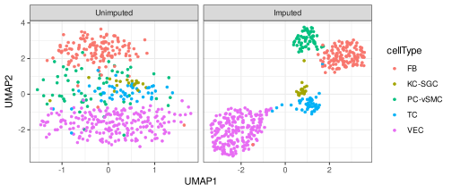

<!-- README.md is generated from README.Rmd. Please edit that file -->

# DURIAN 

DURIAN (Deconvolution and mUltitask-Regression-based ImputAtioN) is a
hybrid, iterative method for imputation of drop-out in single-cell
expression data. Automatic recovery of missing single-cell reads is
supervised by deconvoluted bulk expression data.

## Installation

Install the pipeline and example data from GitHub.

``` r
# Install the latest version from github
library(devtools)
install_github("mkarikom/DURIAN")
```

## Module Selection

<div>

DURIAN supports the integration of custom deconvolution modules, even
modules written in other languages, such as Julia. Current deconvolution
alternatives include:

  - fast, NNLS regression using [MuSiC
    (R)](https://github.com/xuranw/MuSiC)
  - distributed Monte Carlo inference using [dsLDA
    (Julia)](https://github.com/mkarikom/DistributedStwdLDA.jl)

</div>

## Getting Started

<div>

Check out basic usage of DURIAN running and visualizing imputation of
Human single-cell data in `vignette("basic_usage")`.

</div>

##### Load the package and data

``` r
library(DURIAN)
data(c("C","T","pDataC"))
```

##### Run imputation on the single-cell data, using the bulk data for supervision.

``` r
impresult_list=run_durian(
      scrabble_parameters = c(1,1e-6,1e-4),
      nEM = 5,
      scdata = C,
      metadata = pDataC,
      bulkdata = T,
      deconv_method = "MuSiC",
      nIter_outer = 10,
      nIter_inner = 10,
      nSDCIters = 500000,
      DECONVGENETHRESH=-0.01,
      SCRGENETHRESH=-0.01,
      outerStats = FALSE,
      durianEps=1e-3,
      saveImputationLog = FALSE,
      saveDeconvolutionLog = FALSE,
      saveImputedStep=FALSE)
  impresult = impresult_list[["C"]]
```

##### Construct a low-dimensional UMAP embedding from imputed and original data

``` r
library(umap)
library(ggplot2)
library(reshape2)
umap_imputed = umap(t(impresult))
umap_orig = umap(t(as.matrix(C)))
imputed_df = cbind(umap_imputed$layout,pDataC)
imputed_df$status = "Imputed"
orig_df = cbind(umap_orig$layout,pDataC)
orig_df$status = "Unimputed"
df = rbind(imputed_df,orig_df)
colnames(df) = c("UMAP1","UMAP2","cellID","cellType","sampleID","status")
df$status = factor(df$status,levels=c("Unimputed","Imputed"))
```

##### Plot the original and imputed data

``` r
ggplot(df,aes(x=UMAP1, y=UMAP2,color=cellType)) + 
      geom_point(size=1)+
      facet_grid(~status,scales="free") + theme_bw()
```

<!-- -->
